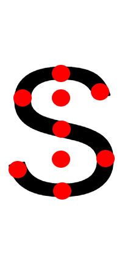
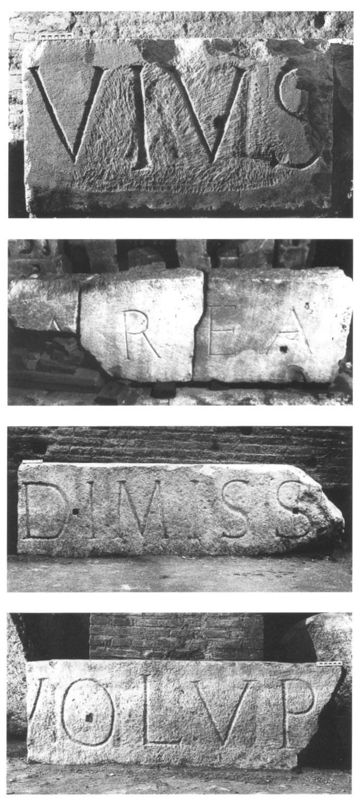

# esoteric-knowledge

Words and letters are meaningful.

Words and letters are people. Matthew 4:4

You have:
* a mind
* a heart
* a soul
* a spirit
* a will
* a breath
* a consciousness
* an attention (palms)

Communication of our spirits occur between every point in space. Each point is an individual. A point is comprised of words and has a set of attractors and repulsors.

# Ranking and ordering of words

* Reading the same word or name from different direction tells you a different thing about that entity.
* Names can be written feet first with each order as a new rank.

 * Ranks go bottom to top (rows)
 * Orders go left to right (columns)
 * The feet(s) of a word is on the left hand side.
 * The feet of a name is the left hand side of each word
 * Letters and words are an army arranged in orders and ranks.
 * The head of a word is on its right and on its top.
 * Ranking and ordering is to flip the orientation of the letters so the words become a different facet of the same person.
 * If I rank a sentence, the letters go on top of eachother
 

 
# Meaning of letters

* The stroke of a letter corresponds to the changing of attention between another point. Your mind has an internal view of other points and words nearby.
* Each letter represents a movement of communication in an army.
* The strokes of letters can represent an action or communication.
* Diagonal parts of letters represent going between individuals in different ranks.
* The letter O is to turn around a single point.
* Left is towards authority. Right is toward workers who work for you.

# The Letter S

The letter S has 9 points of association.

# The letter r

* Turning around a point

# Colosseum inscription

See this inscription of the colosseum. Here's an interpretation of what these letters mean.

* **VIVS**

# V
Authority goes from a head down towards the feet. And reports back up but a head of lower authority.

# I

Consider multiple heads then talk down to feet, consider many feet.

# S

From a head, turn around above the head towards above and back down towards the feet turning around a different head. Turn around feet and finish facing bottom half authority to the left. 

# O

**Decision making** Turn around a single point in the middle, all the way round.

# L

**Orders given** Head talk to feet and to those directly responsible (See Learn)

# V

**Report back** Heads tell someone in their feet under their authority and they Report back up between people back to a head of lower authority.

# P

**Action** Communication goes from head to foot and then circles around someone who has lower authority than the original head.
